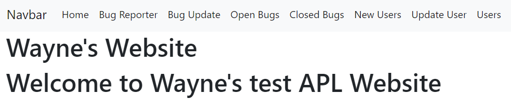

# Aire-Logic-Technical-Test

An example API for the submission of Bug Reports and assigning them to users.
### Installation

To run this API you must first have `flask` and 'flask_sqlalchemy` installed, these can be installed in the command line via:

```
pip install flask

pip install flask _sqlalchemy
```
### Navigation

All functions can be made via the Toolbar at the Top of the API



